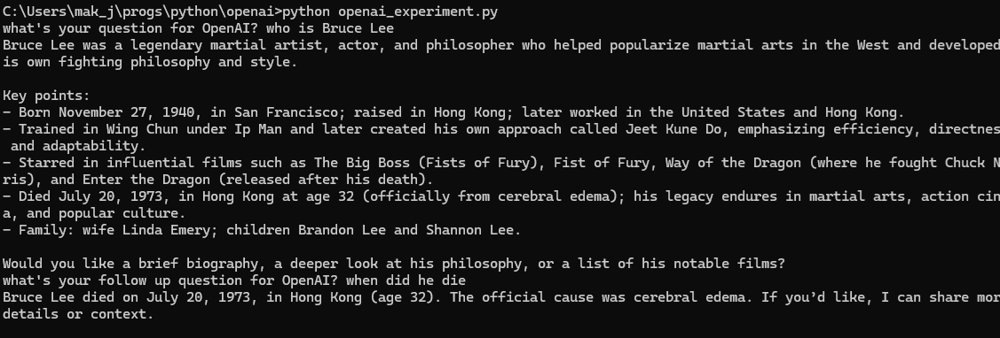

### OpenAI Experiment ###
This is simple collection of Python code to use OpenAI.

First you need to get a OPEN_API_KEY then save into .env file in 1 line:

OPEN_API_KEY = < your api key >

Then install some libraries
```
pip install python-dotenv

pip install openai
```


Modify the python file as you see fit... to do chat completion or get a response.

I asked "Who is Bruce Lee", followed by "When did he die"


